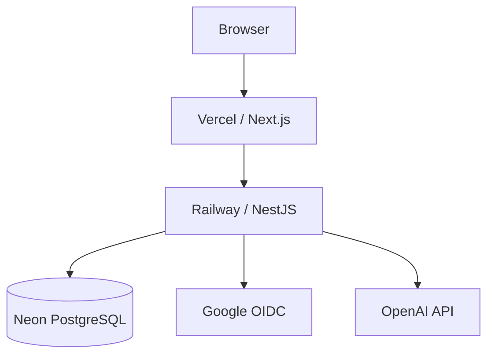

# Orderly

A production-grade full-stack ordering platform built with **Next.js, React, NestJS, PostgreSQL, Prisma and TypeScript**.

Orderly covers the complete ordering lifecycle across customers and administrators:

- guest and authenticated checkout
- customer accounts and Google sign-in
- private order history
- server-controlled order ownership
- Admin order workflows
- menu management
- AI-assisted content editing
- CI/CD and production deployment

The project focuses on production engineering rather than CRUD alone: authentication lifecycle, OAuth account linking, authorization boundaries, concurrency-safe order numbers, server-authoritative pricing, historical snapshots, rate limiting and real database/browser testing.

---

## Live Demo

- **Web:** https://orderly-web-gamma.vercel.app
- **API health:** https://orderly-production-1ac4.up.railway.app/api/health

Production architecture:

```text
Browser
   ↓
Vercel / Next.js
   ↓ same-origin /api
Railway / NestJS
   ↓
Neon PostgreSQL
```

---

## Tech Stack

**Frontend**

- Next.js
- React
- TypeScript
- Tailwind CSS
- Redux Toolkit
- TanStack Query
- React Hook Form

**Backend**

- NestJS
- TypeScript
- PostgreSQL
- Prisma

**Infrastructure**

- Docker
- GitHub Actions
- Vercel
- Railway
- Neon

**Testing**

- Jest
- React Testing Library
- Supertest
- Playwright

**AI**

- OpenAI Responses API
- Structured Outputs

---

# Core Features

## Customer Ordering

Customers can:

- browse API-driven menus
- customise products with sizes and modifiers
- manage a persistent cart
- choose pickup or delivery
- place orders as guests or signed-in users
- track guest orders
- review authenticated order history

Pricing and order totals are recalculated by the backend before persistence.

The browser never controls authoritative pricing.

---

## Customer Authentication

Customer authentication supports:

- email/password registration
- login/logout
- session restoration
- rotating refresh sessions
- protected account routes
- cross-tab session updates
- password changes
- session revocation

Authentication uses HttpOnly cookies and database-backed sessions.

Customer and Admin authentication remain intentionally separate.

---

## Google Sign-In

Google authentication uses:

```text
Authorization Code
+ OpenID Connect
+ PKCE
+ state
+ nonce
```

A successful Google login creates a normal Orderly `CustomerSession`.

Google access tokens are not used as application sessions.

A matching Google email does **not** automatically merge with an existing password account.

Existing password users must sign in first and explicitly connect Google.

---

## Account Management

Customers can manage:

- name
- phone
- password
- connected authentication methods

Email remains read-only in V1.

Changing a password:

```text
verify current password
→ update password
→ revoke previous sessions
→ issue replacement session
```

---

## Authenticated Checkout

Guest checkout remains fully supported.

For authenticated users, order ownership comes from the server-side CustomerSession:

```text
CustomerSession
      ↓
POST /orders
      ↓
server derives customerUserId
      ↓
Order
```

The browser cannot submit ownership IDs.

Checkout contact details remain order-specific snapshots and may differ from the account profile.

If authentication expires during submission, the order is **not** silently downgraded to a guest order.

The user must explicitly choose to continue as guest.

---

## Customer Order History

Authenticated customers can view:

```text
/account/orders
/account/orders/:id
```

History supports:

- status filtering
- newest / oldest sorting
- highest / lowest total sorting
- pagination
- URL-backed state
- browser back/forward restoration
- responsive layouts

Order access is scoped directly by ownership at the database query layer.

Another customer's order, a guest order and a missing order all return the same 404 response.

---

## Historical Order Snapshots

Order details use stored snapshots rather than the current product catalog.

Historical records retain:

- product names
- size selections
- modifiers
- prices
- contact information
- delivery information

So later catalog changes do not rewrite order history.

---

## Guest Order Tracking

Guest orders can be retrieved using:

```text
order number
+
email or phone
```

Order number alone is not sufficient to expose order details.

Authenticated customers can still use guest tracking for older unowned orders.

---

## Admin Orders

Admin users can:

- search orders
- filter by status and fulfillment type
- paginate results
- view order details
- progress orders through the workflow

```text
PENDING
   ↓
ACCEPTED
   ↓
PREPARING
   ↓
READY
   ↓
COMPLETED
```

Backend rules control valid transitions.

---

## Admin Menu Management

The Admin interface supports:

- categories
- products
- availability
- archiving
- search and filters
- drag-and-drop ordering
- nested product options

Option groups support:

```text
SIZE
MODIFIER
ADD_ON
```

with single or multiple selection rules.

---

## AI Menu Assistant

The Admin product editor includes an optional AI-assisted description workflow.

AI output is treated as a draft:

```text
Product Form
   ↓
AI Suggestion
   ↓
Structured Output Validation
   ↓
Human Review
   ↓
Apply / Discard
   ↓
Normal Product Save
```

AI responses never write directly to the database.

---

# Engineering Highlights

## Separate Customer and Admin Authentication

Admin and Customer identity use separate:

- user models
- session models
- JWT configuration
- cookies
- guards
- frontend auth state

Credentials from one domain cannot authenticate the other.

---

## Rotating Sessions

Refresh credentials use:

- database-backed sessions
- cryptographic token digests
- refresh rotation
- compare-and-swap updates
- replay detection
- explicit revocation

This supports logout, password-change revocation and session expiry without relying on stateless JWTs alone.

---

## Safe Google Account Linking

Google's provider `sub` claim is authoritative.

Email equality alone is not treated as proof of account ownership.

This prevents unsafe automatic merging between Google identities and local password accounts.

---

## Server-Controlled Ownership

Authenticated order ownership never comes from request DTO data.

The backend derives ownership from the validated session.

This prevents users from assigning an order to another account.

---

## IDOR Protection

Customer order reads are scoped like:

```text
order.id
+
customerUserId
```

rather than loading an order globally and checking ownership afterwards.

This keeps authorization at the query boundary.

---

## Atomic Order Numbers

Customer-visible order numbers use a PostgreSQL sequence rather than:

```text
read latest order
→ +1
→ create
```

This avoids collisions during concurrent checkout requests and works across application instances.

Sequence gaps after failed transactions are intentionally acceptable.

---

## Server-Authoritative Pricing

The client submits product and option selections.

The server reloads authoritative catalog data and calculates:

- prices
- option deltas
- fees
- totals

before creating the order.

---

## Signed Proxy Identity

Production traffic crosses:

```text
Browser
→ Vercel
→ Railway
```

Vercel derives the normalized client IP and attaches an HMAC-signed identity.

Railway verifies the signature before using that identity for rate limiting.

This avoids relying on unstable proxy hop counts or caller-controlled forwarding headers.

---

# Frontend State Strategy

State is split by ownership.

```text
Redux Toolkit
├─ cart
└─ customer authentication

TanStack Query
├─ menu data
├─ Admin server state
└─ customer-private order state

React Hook Form
├─ checkout
├─ authentication/account forms
└─ Admin product editor
```

Customer-private query data is removed when identity changes or the session expires.

Public menu cache remains intact.

---

# Architecture



Browser API traffic stays same-origin through Vercel:

```text
Browser
   ↓
/api/*
   ↓
Vercel proxy
   ↓
NestJS API
```

This keeps HttpOnly-cookie authentication same-origin while maintaining a separate frontend/backend architecture.

---

# Testing

Orderly uses multiple testing layers.

## API

Jest and Supertest cover:

- authentication
- refresh rotation
- replay detection
- OAuth validation
- account linking
- checkout rules
- server-authoritative pricing
- ownership spoofing
- order-history authorization
- sorting/pagination
- order-number concurrency
- Admin workflows

Database integration tests run against isolated PostgreSQL with real migrations.

---

## Frontend

React Testing Library covers:

- auth state
- session bootstrap
- refresh coordination
- safe return paths
- account management
- checkout prefill
- terminal-session recovery
- private cache cleanup
- Order History URL state
- Admin workflows

---

## Browser

Playwright verifies production-style workflows including:

```text
Guest
Browse
→ Cart
→ Checkout
→ Success
→ Tracking
```

```text
Customer
Register/Login
→ Checkout
→ Owned Order
→ History
→ Detail
```

```text
Security
Customer A order
→ Customer B
→ direct order URL
→ 404
```

Additional browser coverage includes:

- Google authentication
- password changes
- session revocation
- checkout refresh recovery
- mobile layouts
- browser back/forward state

---

# CI/CD

GitHub Actions runs:

```text
Install
   ↓
Prisma generate
   ↓
Lint
   ↓
Typecheck
   ↓
API tests
   ↓
Frontend tests
   ↓
Playwright
   ↓
Production builds
```

Railway applies Prisma migrations before activating a new API deployment.

Vercel builds and deploys the Next.js frontend from Git.

---

# Deployment

| Layer            | Platform |
| ---------------- | -------- |
| Frontend / proxy | Vercel   |
| API              | Railway  |
| PostgreSQL       | Neon     |

Production database traffic uses Neon pooling.

Prisma migrations use a direct database connection.

Secrets remain server-side and are not exposed through `NEXT_PUBLIC_*` variables.

---

# Local Development

Requirements:

- Node.js 22+
- pnpm
- Docker

Install:

```bash
pnpm install
```

Copy `apps/api/.env.example` to `apps/api/.env` and
`apps/web/.env.example` to `apps/web/.env.local`. Replace the four API JWT
secret placeholders with independent random values before starting the API.
Generate Prisma Client with `pnpm db:generate` after installation.

Start PostgreSQL:

```bash
pnpm db:up
```

Run migrations:

```bash
pnpm db:migrate
```

Start API:

```bash
pnpm dev:api
```

Start frontend:

```bash
pnpm dev:web
```

Run API tests:

```bash
pnpm --filter api test:unit
pnpm --filter api test:e2e
```

Run frontend tests:

```bash
pnpm test:web
```

Run browser tests:

```bash
pnpm test:browser
```

Run the full quality gate:

```bash
pnpm test:quality
```

See `.env.example` and `/docs` for detailed configuration, authentication, deployment and testing notes.

---

# Key Engineering Decisions

- Separate Customer and Admin authentication rather than building an unnecessary generic auth framework.
- Keep JWT credentials in HttpOnly cookies.
- Use database-backed sessions for rotation and revocation.
- Treat Google `sub`, not email, as provider identity.
- Keep guest checkout first-class.
- Derive authenticated order ownership exclusively on the server.
- Store historical order snapshots instead of reconstructing them from current catalog data.
- Use PostgreSQL for atomic order-number generation.
- Use URL state for Order History filters, sorting and pagination.
- Use Redux for client-owned state and TanStack Query for server-owned state.
- Use HMAC-signed Vercel client identity instead of guessing proxy hop counts.
- Treat AI output as untrusted draft content requiring human approval.
- Test security and transaction behavior against real PostgreSQL.

---

# Project Status

**Orderly V1 feature development is complete.**

The V1 includes:

- customer ordering
- guest checkout and tracking
- customer authentication
- Google OAuth
- account management
- authenticated order ownership
- private order history
- Admin authentication
- Admin order management
- Admin menu management
- AI-assisted content editing
- PostgreSQL persistence
- automated testing
- CI/CD
- production deployment
- responsive UX
- production security hardening

Current work is focused on **portfolio packaging and presentation**, not additional product functionality.

---

# Documentation

Detailed technical documentation lives under `/docs`, including:

- customer authentication
- deployment
- architecture and operational notes

Additional portfolio documentation and diagrams are being prepared as part of the V1 packaging stage.
